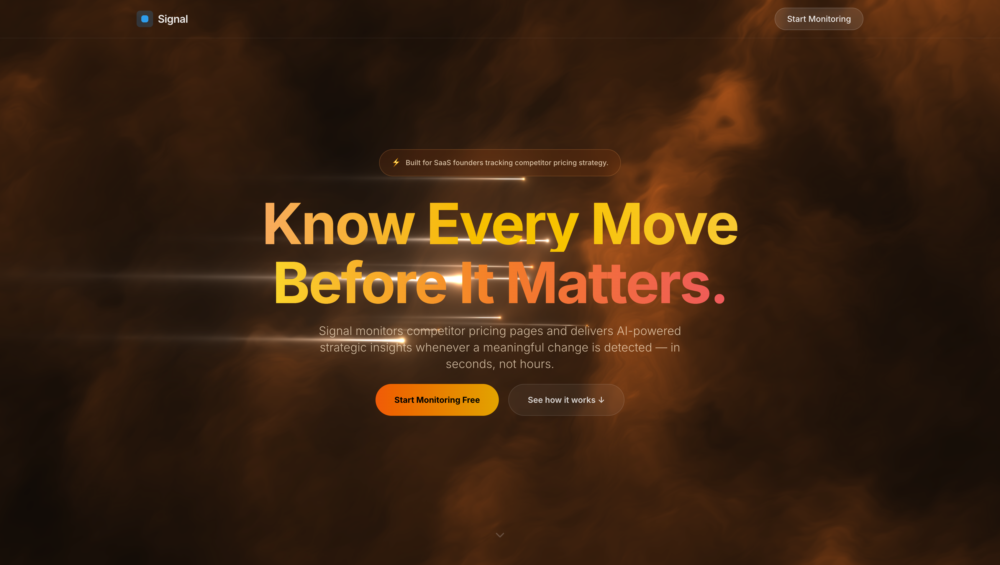
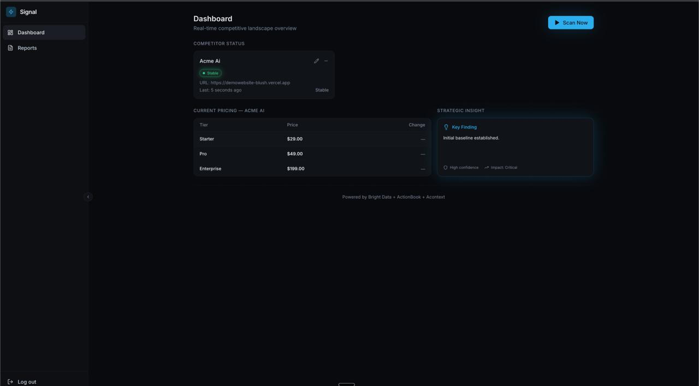
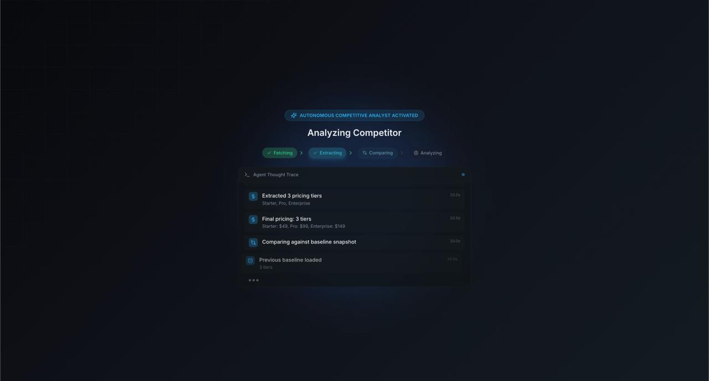

<div align="center">

# Signal — ACIA

### Autonomous Competitive Intelligence for SaaS Teams

<br />

[](https://react.dev/)
[](https://www.typescriptlang.org/)
[](https://supabase.com/)
[](https://ai.google.dev/)
[](https://brightdata.com/)

[Overview](#overview) · [Screenshots](#screenshots) · [Getting Started](#getting-started) · [Architecture](#architecture) · [Integrations](#integrations) · [API](#api-reference)

</div>

---

## Overview

Signal monitors competitor pricing pages and delivers AI-powered strategic insights whenever a meaningful change is detected. Add a competitor URL, run a scan, and get a structured report — no manual research required.

The platform is built around a cost-first design: HTML is scraped, parsed into structured JSON, and compared against a stored baseline. Gemini is only invoked when the delta crosses a 5% significance threshold. Unchanged scans return instantly at near-zero cost.

**Who it's for:** SaaS founders and product managers tracking competitor pricing strategy.

---

## Pitch Deck


---

## Screenshots

### Landing



---

### Authentication


---

### Competitor Pricing — Before Scan


*The live pricing page Signal monitors. On first scan, this is stored as the baseline snapshot.*

---

### Dashboard — Baseline Established



*After the first scan, the pricing structure is stored in Acontext and displayed in the dashboard. Status: Stable.*

---

### Competitor Pricing — After Price Change


*The competitor repriced. Signal detects this on the next scan by comparing against the stored baseline.*

---

### Live Scan — Agent Thought Trace



*The scan pipeline runs in real time: Bright Data fetches HTML, the parser extracts pricing tiers, and the delta engine compares against the Acontext baseline. Each step is shown as it executes.*

---

### Dashboard — Changes Detected


*Signal surfaces the change with per-tier deltas (Starter +69%, Pro +102%, Enterprise −25.1%), a strategic classification, and a Gemini-generated insight — all on the main dashboard.*

---

### Report — Pricing Delta


*The report's pricing tab shows previous vs. current prices across all tiers with percentage change indicators.*

---

### Report — Strategic Intelligence


*The complete intelligence report: pricing delta table, contextual insight, and a full Gemini 2.5 Flash strategic analysis. Generated autonomously.*

---

## Getting Started

### Prerequisites

- Node.js 18+
- Supabase account (free tier works)
- Gemini API key
- Bright Data MCP token or proxy credentials (optional — falls back to direct fetch)
- ActionBook API key (optional — fallback for dynamic pages)
- Acontext API key (optional — falls back to in-memory)

### Run locally

```bash
# Clone
git clone https://github.com/SuhaasNv/ACIA.git
cd ACIA

# Install dependencies
npm install
cd server && npm install && cd ..

# Configure environment
cp .env.example .env
# Fill in your keys in .env

# Start development servers
npm run dev                    # Frontend → http://localhost:5173
cd server && npm run dev       # Backend  → http://localhost:3001
```

---

## Architecture

```
┌─────────────┐     POST /api/scan      ┌──────────────────────────────────────┐
│  React UI   │ ─────────────────────► │         Express API (Node.js)         │
│  (Vite)     │     + JWT Auth          │                                      │
└─────────────┘                         └──────────────────┬───────────────────┘
                                                           │
          ┌──────────────────────────────┬─────────────────┼──────────────────┬──────────────────┐
          │                              │                 │                  │                  │
          ▼                              ▼                 ▼                  ▼                  ▼
  ┌───────────────┐             ┌────────────────┐  ┌────────────┐   ┌──────────────┐   ┌──────────────┐
  │  Bright Data  │             │   ActionBook   │  │  Acontext  │   │   Supabase   │   │    Gemini    │
  │  (Scraping)   │             │  (Web Agent)   │  │  (Memory)  │   │  (DB + Auth) │   │  (Insights)  │
  └───────┬───────┘             └───────┬────────┘  └─────┬──────┘   └──────────────┘   └──────────────┘
          │                             │                 │
          │  MCP → Proxy → Direct       │  Agent nav      │  get/set latest snapshot
          │  (with retries)             │  when <2 tiers  │  (per-user baseline)
          └─────────────────────────────┴─────────────────┘
                                        │
                                        ▼
                           ┌─────────────────────────┐
                           │       Delta Engine       │
                           │  JSON diff of snapshots  │
                           │  ≥5% change → Gemini     │
                           └─────────────────────────┘
```

### Scan pipeline

1. **Fetch** — Bright Data scrapes the competitor URL (MCP → Proxy → Direct, with retries)
2. **Parse** — Raw HTML is parsed into structured JSON (tiers, prices)
3. **Agent fallback** — If fewer than 2 tiers are found, ActionBook autonomously navigates to the pricing page
4. **Baseline** — Acontext retrieves the previous snapshot for this user
5. **Delta** — The diff engine computes changes; if no baseline exists, this is flagged as a first run
6. **Insight** — Gemini 2.5 Flash is called only if the delta is ≥5%; otherwise skipped
7. **Store** — The report is saved to Supabase; the new snapshot overwrites the Acontext baseline

---

## Integrations

### Bright Data

The primary scraping layer. Every scan starts here.

- **MCP (Model Context Protocol):** Connects via SSE to `mcp.brightdata.com`, calls the `scrape_as_html` tool for clean HTML
- **Proxy:** Routes requests through Bright Data's residential proxy network for anti-bot bypass
- **Direct:** Plain HTTP fetch with browser-like headers — used when no credentials are configured

All three strategies are attempted in order with retries and exponential backoff.

---

### ActionBook

An autonomous web agent used as a fallback when static scraping returns insufficient pricing data.

Triggers when Bright Data + the HTML parser find fewer than 2 pricing tiers — typically because the user provided a homepage URL instead of a direct pricing page, or because the pricing is rendered dynamically.

- `navigateToPricing(url)` — Starts from the homepage, identifies and clicks pricing-related navigation links, and returns the rendered pricing page HTML
- `extractDynamicHtml(url)` — Renders a URL and waits for pricing-specific CSS selectors before returning content

---

### Acontext

The memory layer for per-user pricing baselines.

- `getLatestSnapshot(userId)` — Retrieves the structured pricing JSON from the previous scan before computing the delta
- `setLatestSnapshot(userId, data)` — Writes the new snapshot after a scan completes, overwriting the previous one

Falls back to an in-memory `Map` if no API key is configured. The key format is `competitor:{userId}:latest_snapshot`.

---

## Tech Stack

| Layer | Technologies |
|---|---|
| Frontend | React 18, TypeScript, Vite, Tailwind CSS, shadcn/ui, Framer Motion |
| Backend | Node.js, Express |
| Database & Auth | Supabase (PostgreSQL + Auth) |
| Scraping | Bright Data (MCP, Proxy, Direct) |
| Web Agent | ActionBook |
| Memory | Acontext |
| AI | Google Gemini 2.5 Flash |

---

## Project Structure

```
ACIA/
├── src/                        # Frontend (React + Vite)
│   ├── components/             # UI components (shadcn + custom)
│   ├── contexts/               # Auth context (Supabase)
│   ├── pages/                  # Landing, Dashboard, Processing, Report
│   └── lib/                    # API client, Supabase client
├── server/                     # Backend (Node.js + Express)
│   ├── src/
│   │   ├── controllers/        # Scan controller
│   │   ├── middleware/         # JWT authentication
│   │   ├── routes/             # API route definitions
│   │   └── services/           # brightdata, actionbook, acontext, gemini, diff
│   └── server.js
├── images/                     # Product screenshots
├── docs/                       # Architecture and flow documentation
└── .env.example                # Environment variable reference
```

---

## Environment Variables

| Variable | Required | Description |
|---|---|---|
| `VITE_SUPABASE_URL` | Yes | Supabase project URL |
| `VITE_SUPABASE_ANON_KEY` | Yes | Supabase anon key |
| `SUPABASE_SERVICE_ROLE_KEY` | Yes | Backend service role key |
| `GEMINI_API_KEY` | Yes | Google Gemini API key |
| `BRIGHTDATA_MCP_TOKEN` | No | Bright Data MCP token (primary) |
| `BRIGHTDATA_PROXY_HOST` | No | Bright Data proxy host |
| `BRIGHTDATA_USERNAME` | No | Bright Data proxy username |
| `BRIGHTDATA_PASSWORD` | No | Bright Data proxy password |
| `ACTIONBOOK_API_KEY` | No | ActionBook agent API key |
| `ACONTEXT_API_KEY` | No | Acontext memory API key |

See `.env.example` for the full list with defaults.

---

## API Reference

### `POST /api/scan`

Triggers a full competitive intelligence scan for the authenticated user's configured competitor.

**Headers:** `Authorization: Bearer <jwt>`

**Response:**
```json
{
  "isFirstRun": false,
  "hasSignificantChange": true,
  "classification": "Aggressive Expansion",
  "insight": "Strategic analysis text...",
  "delta": {
    "changes": [
      { "tier": "Pro", "old_price": 49, "current_price": 99, "percent_change": 102.0, "type": "increased" }
    ]
  },
  "scanMeta": {
    "dataSource": "brightdata",
    "actionBookUsed": false,
    "tiersFound": 3,
    "durationMs": 8500,
    "steps": [...]
  }
}
```

---

## Documentation

- [Architecture](docs/architecture.md)
- [User Flow](docs/userflow.md)
- [UI Flow](docs/ui-flow.md)

---

<div align="center">

Built by [Suhaas](https://github.com/SuhaasNv)

</div>
